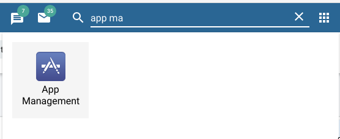
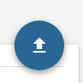

[](https://travis-ci.org/hisptz/scorecard)
[](http://commitizen.github.io/cz-cli/)

# DHIS2 Scorecard APP (With Action Tracker)

This project was generated with [Angular CLI](https://github.com/angular/angular-cli) version 1.2.4. and based on HISPTz DHIS2 Scorecard App. (Improvements to add action tracker)

## Installation
Run ```npm install```

# *Important :* Folder Structure

```bash
app
  - assets (contains non-changing files)
  - environment (sets production to eitheyr true or false)
  - app
    - create #Contains most components for creating, viewing and editing data
    - documentation #Contains components that have documentation. Link : /documentation
    - guards
    - home #Contains components that are loaded on the home page
    - shared #Contains components, pipes and directives that are shared by the different major views eg maps
    - store # contains the global store
    - view # contains the components to view a scorecard
```

The router is located in ```app\src\app-routing.module.ts``` and contains the links to the 

```js
const routes: Routes = [
  {
    path: '',
    canActivate: [UserExistsGuards],
    component: HomeComponent ,
    pathMatch: 'full'
  },
  {
    path: 'documentation',
    component: DocumentationComponent ,
    pathMatch: 'full'
  },
  {
    path: 'edit/:scorecardid',
    canActivate: [UserExistsGuards, ScorecardExistsGuards],
    component: CreateComponent },
  {
    path: 'create',
    canActivate: [UserExistsGuards],
    component: CreateComponent },
  {
    path: 'view/:scorecardid',
    canActivate: [UserExistsGuards, ScorecardExistsGuards],
    component: ViewComponent },
  {
    path: '**',
    redirectTo: 'HomeComponent' }
];
```

## Development server

Run `ng serve` for a dev server. Navigate to `http://localhost:4200/`. The app will automatically reload if you change any of the source files.

## Code scaffolding

Run `ng generate component component-name` to generate a new component. You can also use `ng generate directive|pipe|service|class|module`.

## Build

Run `ng build` to build the project. The build artifacts will be stored in the `dist/` directory. Use the `-prod` flag for a production build.

## Running unit tests

Run `ng test` to execute the unit tests via [Karma](https://karma-runner.github.io).

## Running end-to-end tests

Run `ng e2e` to execute the end-to-end tests via [Protractor](http://www.protractortest.org/).
Before running the tests make sure you are serving the app via `ng serve`.

----

## INSTALLATION To DHIS2 Instance

### 1. Change the base url in ./src/app/url.ts

```ts
// optional but you can put here your DHIS2 version eg 29 for 2.29
export const DHIS2VERSION = ''; 
// replace the BASEURL with the base url of your dhis2 instance. etc https://hiskenya.org
export const BASEURL = 'https://play.dhis2.org/2.29/';
// Leave these as they are
export const APIURL = BASEURL + 'api/';
export const DATASTORE = APIURL + 'dataStore/ActionTracker/';
export const VERSIONEDAPIURL = APIURL + DHIS2VERSION;

```

### 2. Build for Production

In the base folder, run `npm run build` and wait for it to build.

After everything is build, `cd into the dist folder` and modify the *manifest.webapp* as Following:

- name: Your Desired Name eg Scorecard Tracker
- description: Your Description of the app

```json
{
    "version": "2.4",
    "name": "Scorecard 2.4-beta-1.4",
    "description": "Score Card Generation",
    "launch_path": "index.html",
    "language": "en",
    "icons": {
        "16": "scorecard.png",
        "48": "scorecard.png",
        "128": "scorecard.png"
    },
    "developer": {
        "name": "HISP Tanzania",
        "url": "http://hisptanzania.org/"
    },
    "default_locale": "en",
    "activities": {
        "dhis": {
            "href": "../../.."
        }
    }
}

```

### 3. Zip to upload

Select everything in the dist folder and zip it. Make sure that *manifest.webapp* is in the root of the zip file.

### 4. Upload the app

Login to your DHIS2 instance and search for 'app management'




On the App management page, click on the Upload icon




Choose the *zip* file you made in Step 3

### 5. Use the App
You can now search for the app just like any other in your DHIS2 instance

---


## Further help

To get more help on the Angular CLI use `ng help` or go check out the [Angular CLI README](https://github.com/angular/angular-cli/blob/master/README.md).

## Reference 
Alma Scorecard [Alma Scorecard](http://alma2030.org/scorecards?country=kenya&year=2017&quarter=q3).
DHIS2 Scorecard (hisptz) [Scorecard App DHIS2](https://github.com/hisptz/scorecard).

----

## Modified by [rapando](https://github.com/rapando)
